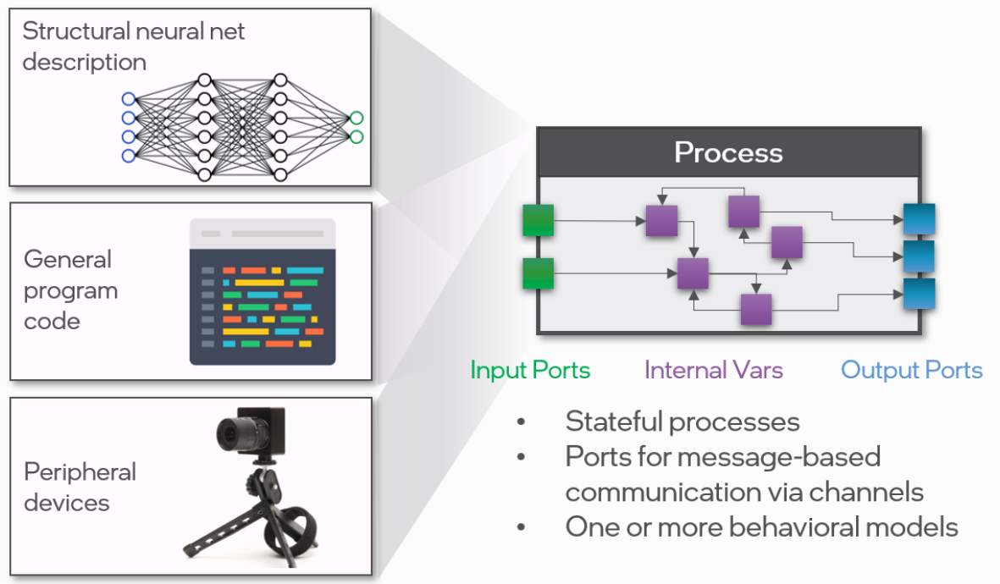
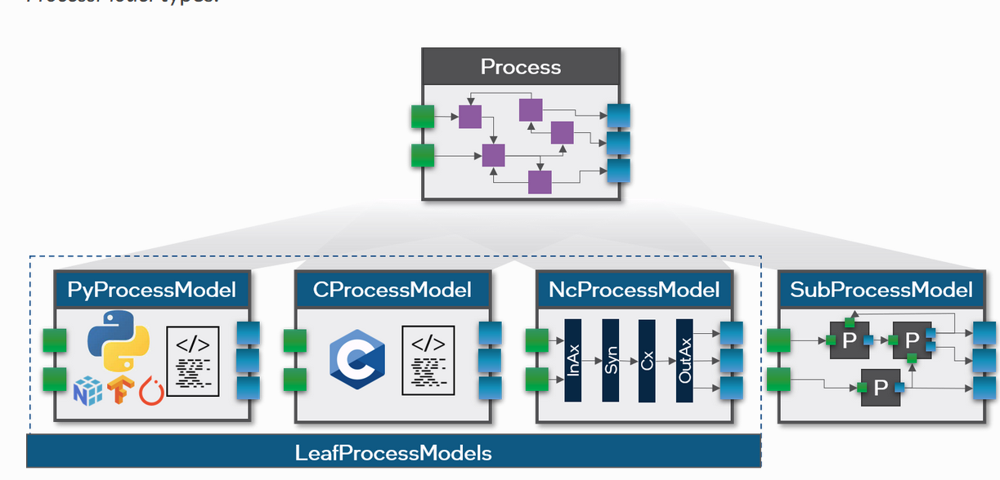
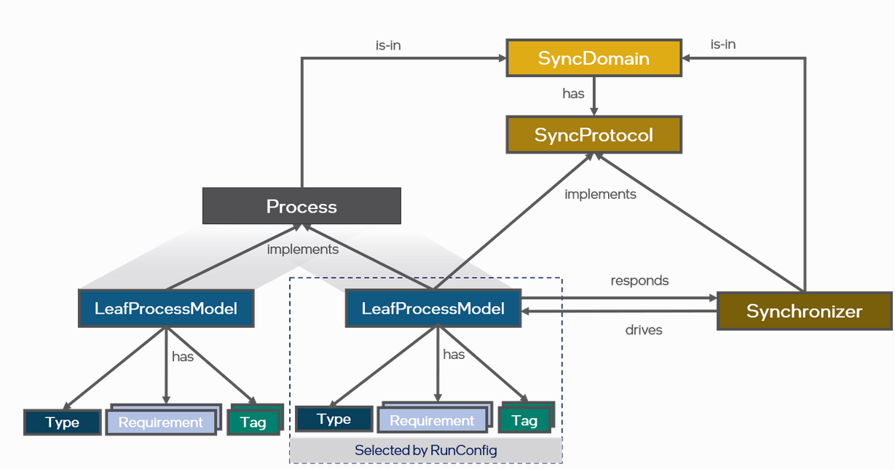

---

---

# [**LAVA**](https://lava-nc.org/)

## 1 Introduction

> Lava是一个开放的、社区开发的代码库，它结合了神经形态计算社区所追求的各种方法。它为研究人员提供了一个模块化、可组合和可扩展的结构，以将他们的最佳想法集成到不断增长的算法库中，同时引入新的抽象，使其他人可以在这些想法的基础上进行构建，而不必重新发明它们。为此，Lava允许开发人员定义多功能过程，如单个神经元、神经网络、常规编码程序、与外围设备的接口以及与其他软件框架的桥梁。Lava允许将这些过程的集合封装成模块并聚合以形成复杂的神经形态应用。Lava进程之间的通信使用基于事件的消息传递，其中消息可以从二进制峰值到千字节大小的数据包。

[^1]: 读了这里感觉我们可以将GNN的算子集成到该算法库中，具体是否可行再往后看看

### 1.1 与平台无关

> Lava是平台无关的，因此应用程序可以在传统CPU/GPU上原型化，并部署到跨传统处理器以及一系列神经形态芯片（如Intel的Loihi）的异构系统架构中。为了编译和执行不同后端的进程，Lava构建在一个名为Magma的低级接口上，该接口具有强大的编译器和运行库。随着时间的推移，Lava开发者社区可能会增强Magma，使其在最初支持英特尔Loihi芯片的基础上，瞄准更多的神经形态平台。

[^2]: Magma接口，是为了适应不同的硬件(backends)。现在已经支持的就是CPU、GPU、Loihi。不知道现在是否enhance到更多的神经形态处理器。现在可以买到的神经形态处理器都是PCIe接口的，USB这种轻量级的接口并没有查到。

### 1.2目前支持的工作

> - 异步进程之间基于通道的消息传递（通信顺序进程范例）
> - 超粒度并行，计算是进程间交互的集体结果
> - 具有传统和神经形态组件的异构执行平台
> - Offline backprop-based training of a wide range of neuron models and network topologies
> - 用于生成复杂脉冲神经网络的工具，例如动态神经场和解决定义良好优化问题的网络
> - 与第三方框架集成

[^3]: 没啥用，还得接着看。提供了一个简单的python接口，底层是C/C++/CUDA代码

## 2 Lava架构

### 2.1 关键属性

> - 异步并行：基于异步时间处理的软件架构，用于分布式、神经形态、异构(CPU/GPU)和大规模并行的硬件平台，支持边缘到云的系统
> - 细化：Lava通过将抽象计算过程细化为特定于体系结构的实现来促进迭代软件开发。这使得应用程序开发可以从高级行为模型开始，这些模型可以依次分解为针对不同平台优化的低级模型
> - 跨平台：Lava支持在新型神经形态架构(如Intel Loihi)以及传统CPU/GPU架构上灵活地跨平台执行计算进程。它具有双重灵活性:允许相同的计算进程在不同的平台上执行，同时也允许不同的进程通过消息传递跨体系结构执行和交互
> - 模块化和可组合：Lava的计算过程遵循一致的架构，使它们具有互操作性，从而允许从其他计算过程组合模块化系统
> - 可扩展：Lava是开放和可扩展的，以支持随着时间的推移不断扩大的用例，并与其他第三方框架(如TensorFlow、ROS、Brian等)进行交互
> - 可训练:Lave具有强大的训练算法，可以离线训练模型，并在未来持续在线实时训练模型
> - 可访问性:Lava提供了直观的Python API，用于在分布式并行系统上快速构建和执行模型

### 2.2 Lava的来源

> 在微观尺度上，神经形态系统是受大脑启发的。大脑由大量的神经元和突触组成，它们并行运行，并通过稀疏的异步消息(脉冲，spikes)相互通信，这导致了计算效率的大幅提高。
>
> 在宏观尺度上，神经形态硬件系统通常涉及多个物理计算元素，从特殊用途的神经加速器到传统的CPU/ GPU、传感器或执行器设备。神经形态硬件系统和Lava从头开始反映了这种普遍的、大规模并行的异质架构。在Lava中构建的所有算法都是由独立的、模块化的计算过程构建的，这些计算过程可以在不同的硬件平台上执行，并通过通用消息类型进行通信。
>
> 到目前为止，还没有一种单一的开放软件框架能够以连贯、易于使用和高性能的方式将所有这些架构方面结合起来，从而为更广泛地采用神经形态技术铺平道路。

### 2.3 Lava的基本概念

#### 2.3.1 Processes

> Processes是Lava体系结构中的基本构建块，所有算法和应用程序都是基于它构建的。Processes是具有内部变量、输入和输出端口的有状态对象，用于通过通道进行基于消息的通信。Processes有不同的形式。Processes可以像单个神经元一样简单，也可以像ResNet架构那样复杂的整个神经网络，或者兴奋性/抑制性网络。Processes也可以表示常规的程序代码，如搜索算法、系统管理进程或用于数据预处理和后处理。此外，还可以将传感器或执行器等外围设备包装到Processes抽象中，以便将它们与其他计算流程无缝集成到Lava应用程序中。简而言之，Lava中的一切都是一个Processes，它拥有自己的私有内存，仅通过消息与环境进行通信。这使得Lava Processes成为一种递归编程抽象，可以构建模块化的大规模并行应用程序。
>
> 

请注意，Process只定义Vars和port，而不定义行为。这是在ProcessModel中单独完成的。将接口与行为实现分离的好处是，我们可以在不更改接口的情况下，使用多个processmodel为多个硬件后端定义Process的行为。

变量也可以作为成员变量访问。我们可以打印特定Var的详细信息，以查看形状、初始值和当前值。shareable属性控制Var是否可以通过远程内存访问进行操作。

还有一个set函数可用于在网络执行后更改Var的值。

#### 2.3.4 Behavioral implementations via ProcessModels

> Process类本身仅根据状态变量、端口和其他类方法定义Process的接口，以供其他Process使用或与任何给定Process交互。但是，Process不提供行为实现，以使Process在特定的硬件体系结构上可执行。
>
> 行为实现——即变量、端口、通道和内部业务逻辑的具体实现——是通过单独的ProcessModel类提供的。Process可以有一个或多个相同或不同类型的processmodel。我们将ProcessModel类型分为两类:
>
> 
>
> - **SubProcessModels:**实现ProcessModels的第一种方法是根据其他Process。使用SubProcessModel，可以实例化、配置和连接其他子Process，以定义父Process的行为。SubProcessModel的端口可以连接到其子Process的端口，子Process的变量可以根据需要公开为父Process的变量，以便在父Process的环境中访问它们。通过子Process对父流程的这种类型的细化可以递归地应用，并将导致树状结构的Process/ProcessModel层次结构，该层次结构允许构建复杂且可重用的应用程序模块。
> - **LeafProcessModels:** ProcessModels也可以直接实现，而不是由其他子Process组成。在本例中，我们将它们称为LeafProcessModels，因为它们形成了树状结构的Process层次结构的叶。这样的leafprocess可以用Python或C等编程语言实现。对于不同的硬件架构，LeafProcessModel代码可以直接用冯-诺依曼处理器的可执行指令来描述计算，可能使用Numpy、TensorFlow或PyTorch等外部库。相比之下，像神经形态核这样的计算资源不执行任意的指令序列，而是通过结构描述指定的集体动态来执行，从而获得计算优势。在这种情况下，这些核心对应的NcProcessModels代码负责神经网络资源的结构分配和配置，例如神经核心中的轴突、突触和神经元。在未来，Lava Processes可能还会用行为模型来模拟和指定模拟神经形态芯片的操作，这些行为模型只会大致匹配它们的实时执行。
>
> 一般来说，在神经形态架构中，计算来自于通常是近似的、不确定的、并且可能在不同平台的具体执行中有所不同的集体动态过程。因此，Lava将行为视为建模的，而不是编程的或指定的，这激发了ProcessModel这个名称。
>
> 基本上，系统或网络中的所有Process都是并行操作的，并且通过交换消息令牌彼此异步通信。但是许多用例需要Process之间的同步，例如实现一个离散时间动力系统，表示从一个算法时间步进到下一个算法时间步的特定神经元模型。Lava允许开发人员定义同步协议，描述同一同步域中的Process如何相互同步。此同步协议由SyncDomain中的同步器编排，它与SyncDomain中的所有Process交换同步消息令牌。编译器可以根据它实现的SyncProtocol自动将Process分配给SyncDomain，也可以允许用户手动将Process分配给SyncDomain，以更详细地自定义Process之间的同步。
>
> 
>
> 

