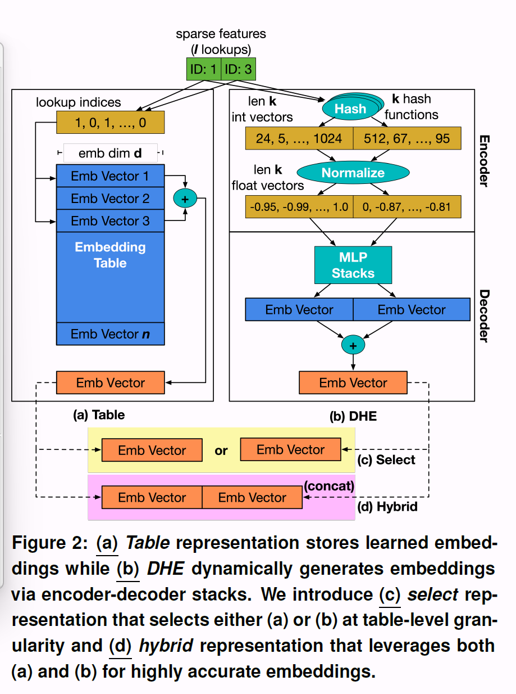
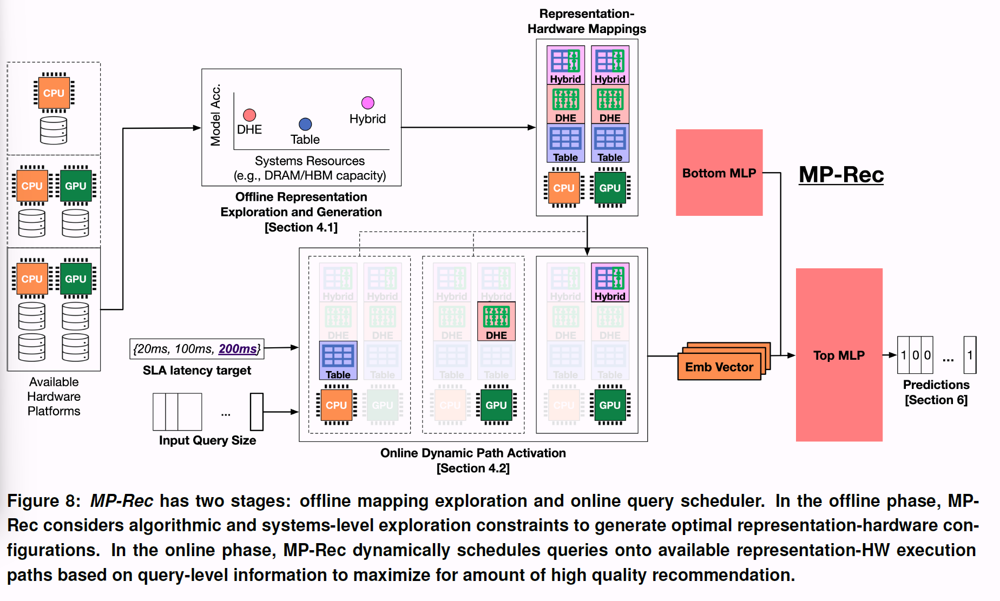
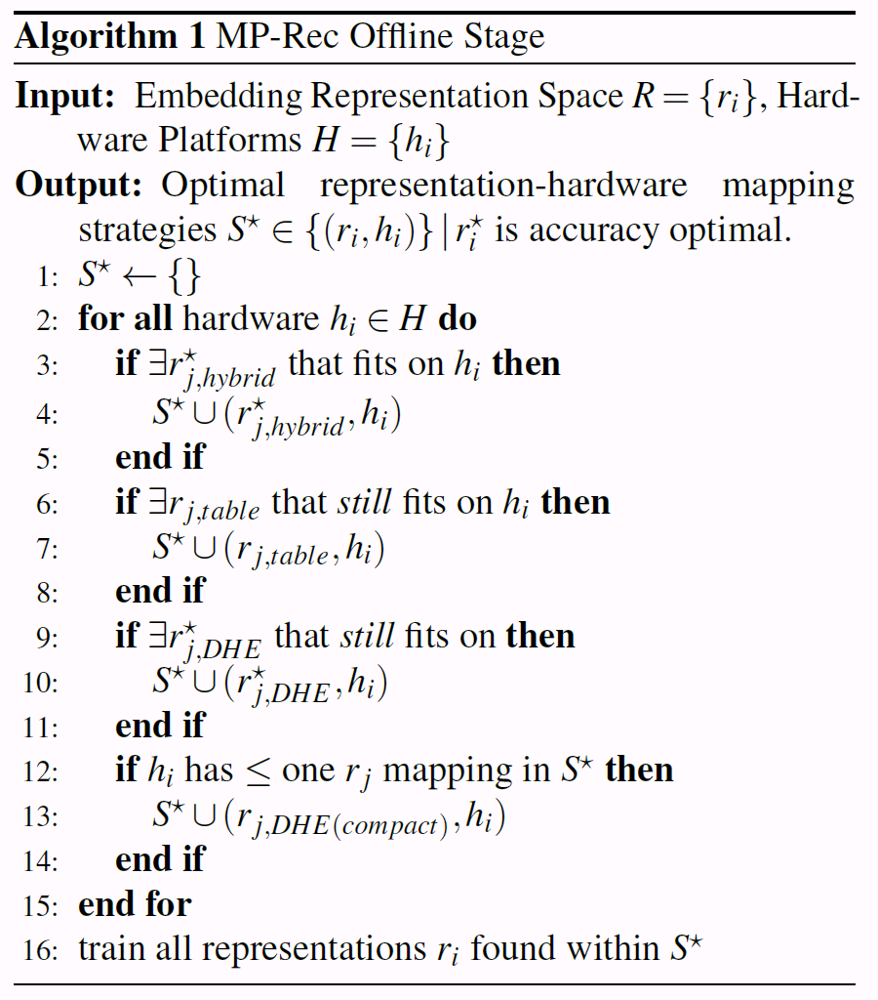
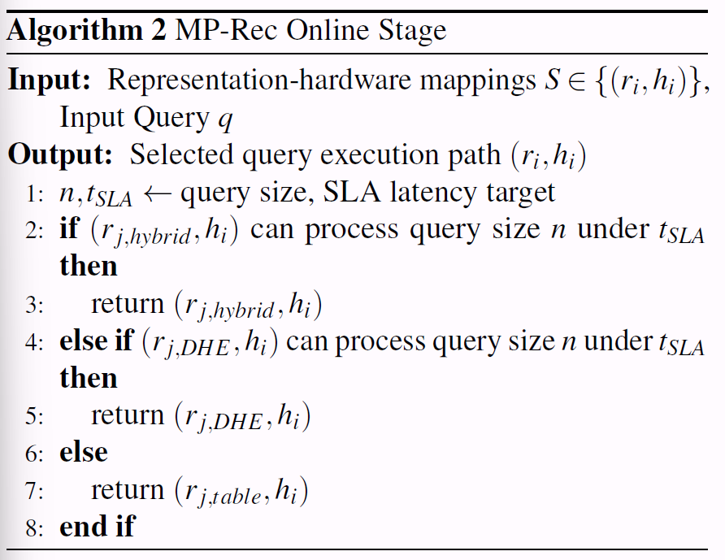
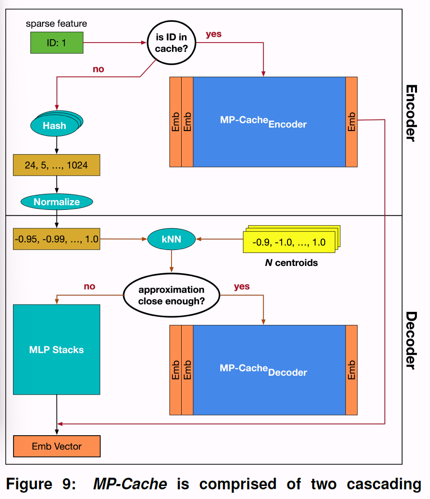

# MP-Rec

## 1 motivation

最先进的推荐模型的一个关键组成部分是embedding table，其日益增长已经到了TB级别。因此，大量的推荐系统和硬件解决方案专注于解决大规模嵌入表的内存容量和带宽挑战。

然而，如果不使用嵌入表，使用（编码器-解码器）堆栈（DHE）来动态生成embedding，会有更高的计算需求

DHE：Deep Hash Embedding

在这个motivation下，开发了一种混合的embedding表示。（结合了上述两种方法，但是能够产生更高质量的embedding，并提高学习能力）

## 2 贡献

> - 提出了一种新的混合嵌入表示，以增加计算和内存需求为代价，提高学习能力并产生更高质量的嵌入。混合嵌入表示显示了模型质量的可测量的改进。
> - 使用最先进的自定义AI加速器(即TPU和IPU)实现不同的嵌入表示。确定了将特定表示适应加速器的关键系统挑战，强调了加速器特有的独特优势:用于嵌入表的TPU，用于紧凑计算堆栈的IPU，以及用于高效模型执行的GPU
> - 提出了一种用于深度学习推荐推理的动态表示硬件协同设计技术MP-Rec。MP-Rec缓解了静态表示-硬件映射带来的性能和精度下降。用两层缓存设计(MP-Cache)来增强MPRec，以利用在基于计算的表示中发现的独特缓存机会

## 3 新的embedding表示

> One-hot Embedding的编码阶段将特征表示为one-hot的稀疏向量，解码阶段通过巨大的embedding look-up table（可看作一层神经网络）得到该特征的唯一表示。
>
> DHE编码阶段通过多个(k=1024个)哈希函数将特征表示为稠密的Identifier vector, 解码阶段通过多层神经网络得到该特征的唯一表示

DHE将embedding计算从内存需求转移到计算需求

两种新的表示方法：select和hybrid

> 使用选择嵌入表示法，推荐模型设计人员可以对每个稀疏特征进行前面提到的内存-计算权衡（图2c）
>
> 在这种混合表示中，稀疏id用于访问嵌入表和动态生成嵌入向量。然后将来自这两种机制的结果嵌入连接起来。嵌入表和解码器MLP堆栈一起训练（图2d）

## 4 MP-Rec

离线阶段：MP-Rec决定将使用哪些嵌入表示及其对应的硬件映射策略(算法1)。嵌入表示和映射决策基于系统内存容量

在线阶段：MP-Rec考虑服务水平协议(SLA)，如模型精度和尾部延迟目标，应用程序和运行时因素，如输入查询大小(算法2)。MPRec通过在可用硬件平台上动态激活表、DHE或混合执行路径，从稀疏特征生成嵌入向量

MP-Cache：在DHE的encoder和decoder阶段引入Cache

