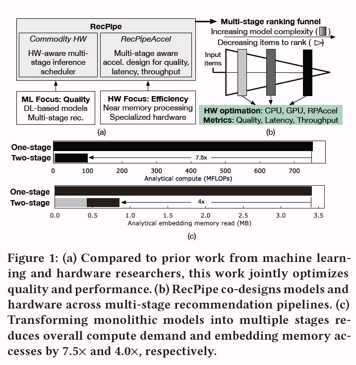
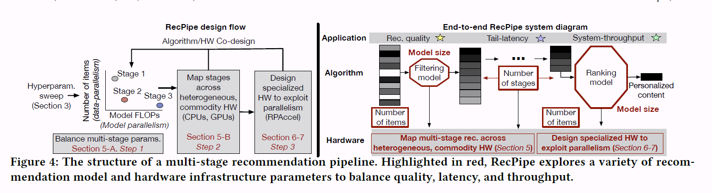
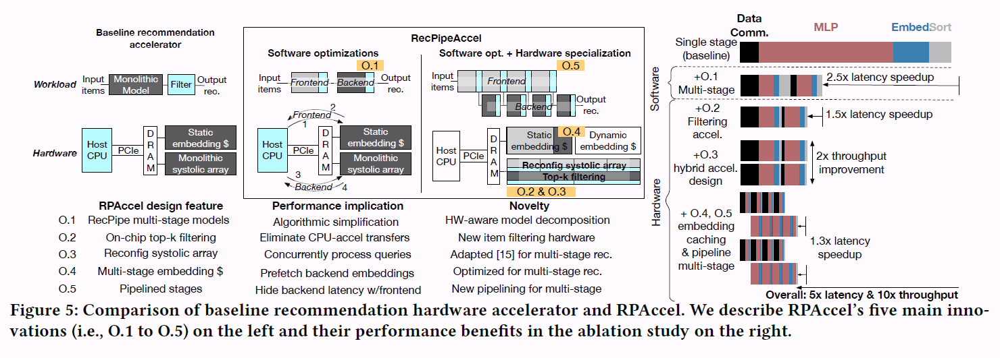
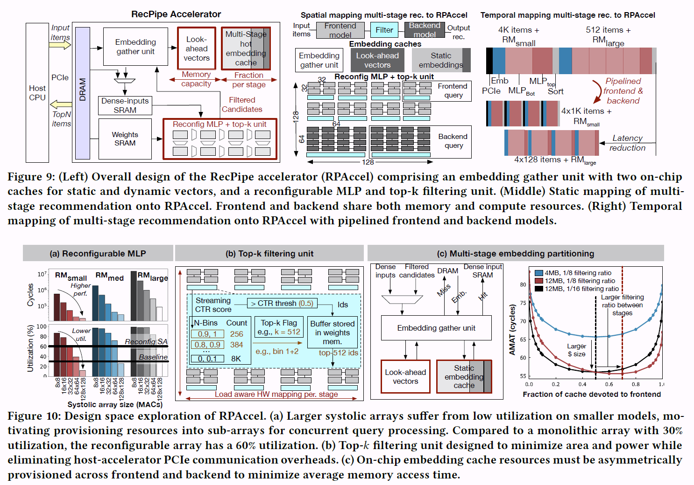

# Rec-Pipe

## 1 motivation

针对日盈增长的推荐模型复杂性和其对硬件设施的需求，有一系列的解决办法（推理调度器、近内存处理硬件、专用加速器）。但是这些都是假定模型时固定的，这为效率优化留下了空间。而近年来CV、NLP领域工作证明，与硬件共同设计模型是一种有效的方法。

推荐模型的准确性代表了模型预测用户是否喜欢单个商品的能力，但是生产的目标是为用户提供个性化的相关商品集合，在推荐中，模型会对数千种商品进行排名，以衡量整体质量，质量是根据用户的个人喜好来衡量呈现给用户的整个项目集合的相关性。

对所有具有复杂模型的item排序是一种浪费，因为只有一小部分与单个user有关。传统的推荐模型通过使用复杂的DNN模型对大量的输入进行排序来实现高质量，这导致了性能开销。通过将这一个阶段分解为多阶段推荐，前阶粗略的过滤相关项目，后阶段进行精细地排序，复杂的模型只对需要精确区分的项目进行排序，这大大降低了计算量。

这里的排序是指推荐模型的整个过程：大数据量——大模型。

## 2 贡献

RecPipe：协同设计推荐模型和硬件以提高质量和性能的系统（图1a）

前端阶段将轻量级模型(例如，低计算和内存需求)与大输入大小配对，即数据并行性。后端阶段将重量级模型(例如，数十亿的FLOP，许多GB的存储)与较小的输入大小配对，即模型并行性。

> RecPipe的系统解决方案利用这些独特的并行机会来共同优化质量、吞吐量和延迟。为了了解商品平台的限制，RecPipe实现了一个推理调度器，它可以跨异构硬件(例如CPU、GPU)映射每个推荐阶段，以实现性能最大化。发现最优的映射依赖于应用层目标和底层硬件。尽管模型和硬件之间有紧密的协同设计，但发现商用CPU-GPU系统并没有充分利用多阶段推荐的好处，因为它们在阶段之间存在低利用率和高PCIe通信开销

为了解决上述限制，提出了RPAccel，一个专门用于多阶段推荐的加速器（硬件）

> RPAccel的硬件优化在低面积和低功耗的情况下提高了效率。首先，RPAccel实现了一个可重构的收缩数组，允许硬件在推荐阶段并发地处理模型。RecPipe的推理调度器根据应用程序负载分配用于前端和后端阶段的收缩阵列资源，平衡延迟和吞吐量。接下来，RPAccel通过实现多个片上过滤单元来识别阶段之间的顶级用户-物品交互，从而消除了与主机处理器的高PCIe通信开销。最后，为了重叠前端和后端查询处理，RPAccel将查询分解成子批处理到管道阶段，并在单独的缓存中预取嵌入向量。

## 3 Rec-Pipe

> RecPipe实现了一个针对多阶段推荐定制的训练后推理调度器。在步骤1中，RecPipe平衡多级建模参数(阶段数、每个阶段的模型数、每个阶段rank的item数)。在步骤2中，RecPipe利用从步骤1中暴露出来的并行机会，并跨异构硬件映射各个阶段。

步骤1：上述两阶段，小模型——大数据，大模型——小数据

步骤2：多阶段模型映射到异构平台（CPU-GPU）。

> GPU实现了一种高度数据并行的架构，可以并行处理单个查询，特别是在具有大工作集的前端。另一方面，多核CPU可以同时处理多个查询，从而提供高吞吐量
>
> RecPipe利用这些特性将每个推荐阶段安排到不同的硬件，最大限度的提高质量和性能。

商用CPU-GPU平台的两个缺点：第一，在前端的数据并行和后端的模型并行中。GPU表现出较低的利用率（由于GPU上embedding查找和内存转换存在着高开销）；第二，CPU和GPU之间的高PCIe通信开销限制了吞吐量。

基于上述限制，RecPipe为多阶段推荐设计专门的硬件（RPAccel）。

## 4 RPAccel体系结构

baseline：使用类似TPU的array和hot-embedding的静态缓存，减少单级推荐模型的推断延迟

> Q1：多级推荐模型，将延迟减少了2.5X
>
> Q2：top-k过滤单元，根据CTR（点击率）确定top k个高质量的item，在后续阶段rank。消除了推荐阶段之间的通信开销（1.5X延迟）
>
> Q3：高可重构的array来并发处理多个阶段和查询（2倍的硬件利用率的吞吐量）。这是因为在软件层面将但阶段模型分解为了多阶段子array
>
> Q4：平衡了片上内存资源，为后端模型静态缓存hot-embedding和动态预取embedding。静态缓存是为前端和后端阶段提供的;当前端完成输入查询的子批次时，动态缓存为后端预取嵌入。
>
> Q5：流水线

硬件细节

> 图9(左)说明了RPAccel的高级体系结构。与现有技术单独加速单阶段模型推理不同，RPAccel被设计为端到端处理查询:多个阶段的模型推理和过滤阶段之间的前k用户-项目交互。图9(中)显示了如何将多阶段推荐映射到RPAccel。跨阶段的网络共享加速器内存和计算资源。对于每个阶段，RPAccel为每个用户-物品对生成预测CTR分数，包括一个MLP和嵌入收集单元。RPAccel实现了一组top-k过滤单元来识别高质量的用户-项目对。
>
> 图9(右)显示了多阶段推荐到RPAccel的时间映射。为了减少延迟，RPAccel通过将查询分解为更小的子批来处理前端和后端阶段。例如，图9(右)显示了RPAccel将一个4K项的查询拆分为四个较小的批量(每个批量为1K)，重叠了前端和后端阶段。为了保持高利用率和高质量，必须仔细平衡分段配料的程度。较小的批处理会导致更高的计算开销，但可以更好地重叠前端和后端阶段。
>
> 最优的小批次：k/n

图10a显示，较大的array有着更小的延迟，但是会降低资源的利用率；

将单片array拆分为多用户的子array，消除了复杂的全方位互联

图10b：为了消除过滤步骤（因为推荐加速器只处理MLP推理，所以推荐步骤需要到CPU运行）的通信开销，直接在硬件上实现了，近似桶的设计降低的资源的消耗

> 最后，embedding table因为不规则内存访问、低计算强度和高存储容量的影响，不适合全部放入缓存。而之前但阶段模型的hot-embedding策略不适合多阶段模型。RPAccel实现了一个多阶段嵌入缓存：
> (1)一个静态嵌入缓存，静态地为来自前端和后端阶段的热嵌入向量提供，(2)一个前向嵌入缓存，为动态查询存储嵌入向量。它还为RPAccel管道优化的后期阶段预取查找(图9(右))。如图9(左)所示，输入嵌入id来自前端模型的主机处理器，或者来自后端模型的top-k过滤单元的输出。基于这些id，嵌入收集单元首先检查相应的向量是否在缓存中。如果是，则将嵌入向量返回到“密集输入SRAM”，由mlp顶层处理。如果不是，则嵌入收集单元从DRAM检索向量到前视嵌入缓存。